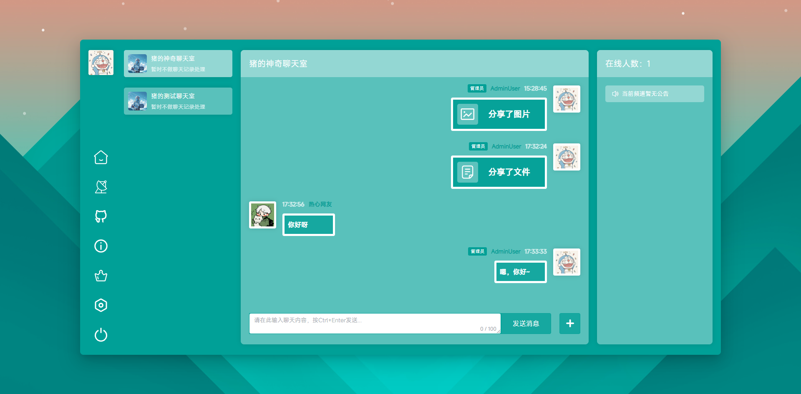
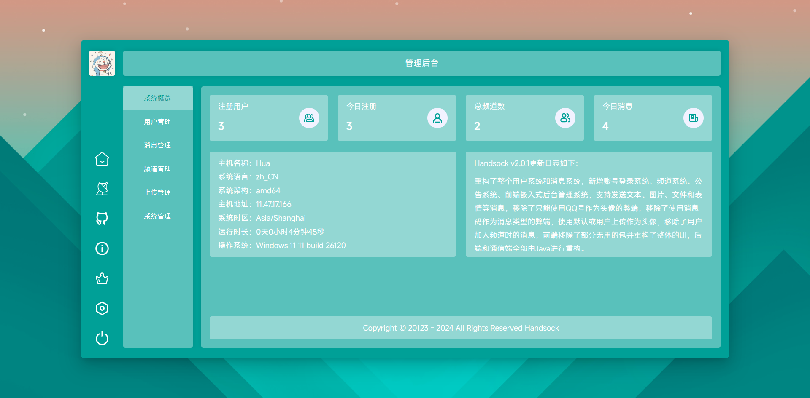

# [HandSock](https://github.com/yichen9247/HandSock) &middot; [](https://github.com/yichen9247/HandSock/blob/main/LICENSE.txt) [](https://github.com/yichen9247) [](http://nodejs.org/download)

HandSock 是一款有趣的聊天应用，基于 Mybatis-Plus，Springboot, Vue3 和 Socket.io，Redis 等技术开发

## 项目截图：客户端





## 环境要求：必要的

```text
Jdk: 22.0.2及以上

Redis: 3.0.0及以上

Mysql：8.0.0及以上

NodeJs: 16.20.2及以上
```

## 配置项目：服务端

配置 `src/main/resources/config/application.yml` 里面的配置信息

## 配置项目：客户端

配置 `src/scripts/config.js` 里面的配置信息

## 启动项目：先打包

先把服务端打包成Jar包然后再以ROOT权限运行

客户端运行通过 `npm run build` 命令打包的dist目录

## 首次运行：管理员

首次运行需要修改管理员账号和密码，以防账号被别人登录：

```text
账号：handsock
密码：handsock123
```

## 关于反向代理配置

如果你使用了反向代理，请修改Nginx或者Apache的配置文件，否则将错误识别客户端的IP

在Nginx的配置文件中，使用proxy_set_header指令来添加Forwarded头：

```js
server {
    listen 80;
    server_name example.com;

    location / {
        proxy_set_header Host $host;
        proxy_set_header X-Real-IP $remote_addr;
        proxy_set_header X-Forwarded-For $proxy_add_x_forwarded_for;
        proxy_set_header X-Forwarded-Proto $scheme;
    }
}
```

在Apache的配置文件中，使用RequestHeader指令来添加Forwarded头：

```xml
<VirtualHost>
    ProxyPreserveHost On
</VirtualHost>
```

## License

HandSock is [MIT licensed](https://github.com/yichen9247/HandSock/blob/main/LICENSE.txt)