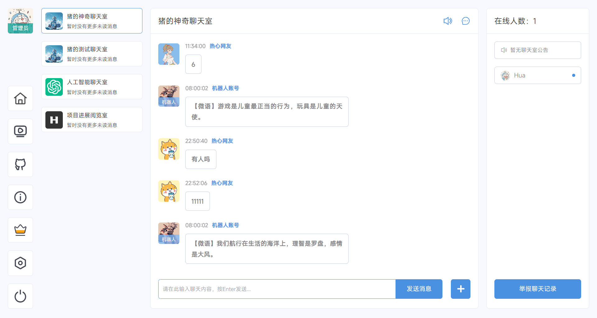
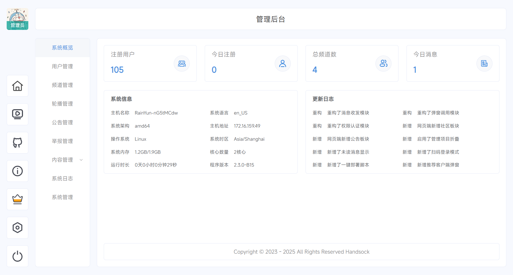

# [HandSock](https://github.com/yichen9247/HandSock) &middot;   

HandSock 是一款有趣的聊天应用，基于 Mybatis-Plus，Springboot, Vue3 和 Socket.io，Redis 等技术开发

[项目文档](https://doc.handsock.xiaokolomi.cn)
&nbsp;
[演示站点](https://doc.handsock.xiaokolomi.cn)

## 项目截图

## License

HandSock is [MIT licensed](https://github.com/yichen9247/HandSock/blob/main/LICENSE.txt)